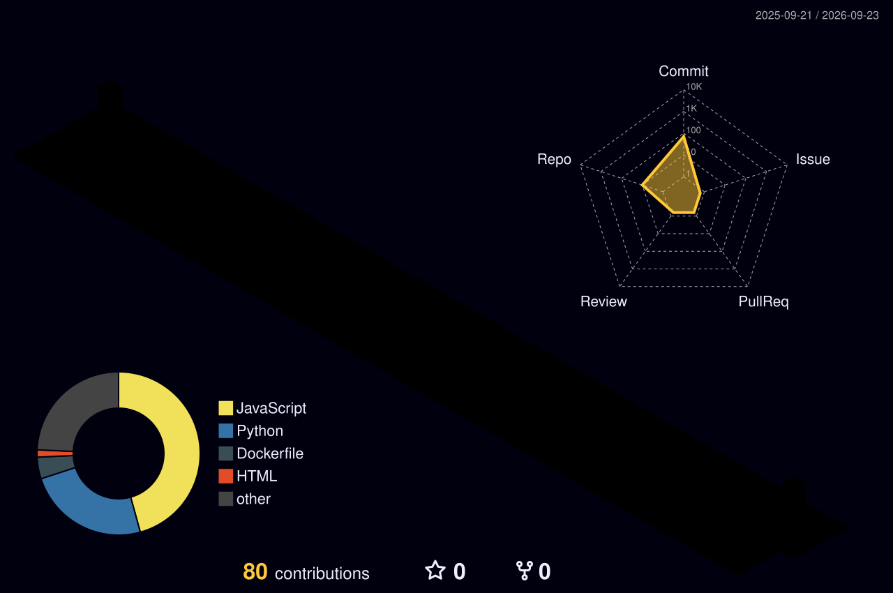

<h1 align="left">Hey, I'm Neelesh Kumar Tripathi 👋</h1>

  <b>Full-Stack Developer · DSA Enthusiast · Builder</b> 
  4th Year ISE @ The National Institute of Engineering, Mysore

---

## Connect with me

  
  
  
  

---

## Languages and Tools

  
  
  
  
  
  
  
  
  
  
  
  

---

## 🧠 DSA

- 💻 **500+ DSA Problems Solved**
- 🏆 **LeetCode Global Rank ~1533**
- 📚 Solved problems across **LeetCode, GeeksforGeeks, and other platforms**
- 🔥 Consistently improving problem-solving and competitive programming skills

---

## 🚀 Featured Projects

### 🧠 Crackd — AI-Powered Placement Assistance Platform

**MERN · MongoDB · JWT · Hugging Face API · REST APIs · Axios**

A peer-to-peer platform where seniors share company-wise interview experiences and juniors use them for focused preparation.

- Integrated **Hugging Face API** to generate personalised AI preparation roadmaps
- Implemented **JWT authentication** and role-based access control
- Built roadmap tracking and progress dashboards
- Designed company-wise interview preparation workflows

---

### 🔎 FinNIE — Lost & Found Platform

**Flask · MySQL · HTML · CSS · JavaScript**

A full-stack platform for reporting, discovering, and managing lost and found items.

- Built the backend using **Flask and MySQL**
- Implemented keyword-based search and category filtering
- Achieved **sub-10ms query performance**
- Designed a simple workflow for reporting and finding items

---

### 🤟 Sign Language ↔ Speech Translation Platform

**Python · Machine Learning · OpenCV · Whisper · APIs**

An accessibility-focused platform designed to bridge communication between deaf/mute students and educators.

- Built during **DevJams VIT in 36 hours**
- Trained ML models using **180+ gesture samples**
- Achieved approximately **80% gesture recognition accuracy**
- Implemented real-time sign, speech, and text translation
- Targeted real-time classroom communication

---

## 🏆 Achievements

- 🥈 **4th Place — DevJams VIT National Hackathon**
- 📊 **LeetCode Global Rank ~1533**
- 🧠 **500+ DSA Problems Solved**
- 🏛️ **Management Core Team Member — The BYTE Club, NIE**
- 🎙️ Organised **10+ workshops and coding events**
- 👥 Events and workshops reaching **200+ students**

---

## 📊 GitHub Stats

  
  

  

---

## 🗼 3D Contribution Graph

  

> This isometric graph (contribution blocks + languages donut + activity radar) is generated by the
> [`yoshi389111/github-profile-3d-contrib`](https://github.com/yoshi389111/github-profile-3d-contrib) GitHub Action —
> the same one used to build the graph in the example you shared. It renders automatically from your real
> GitHub activity, so set it up once and it stays fresh on its own. Setup steps below.

---

## 📈 Coding Profiles

  

---

  <i>Building products. Solving problems. Learning every day. 🚀</i>

